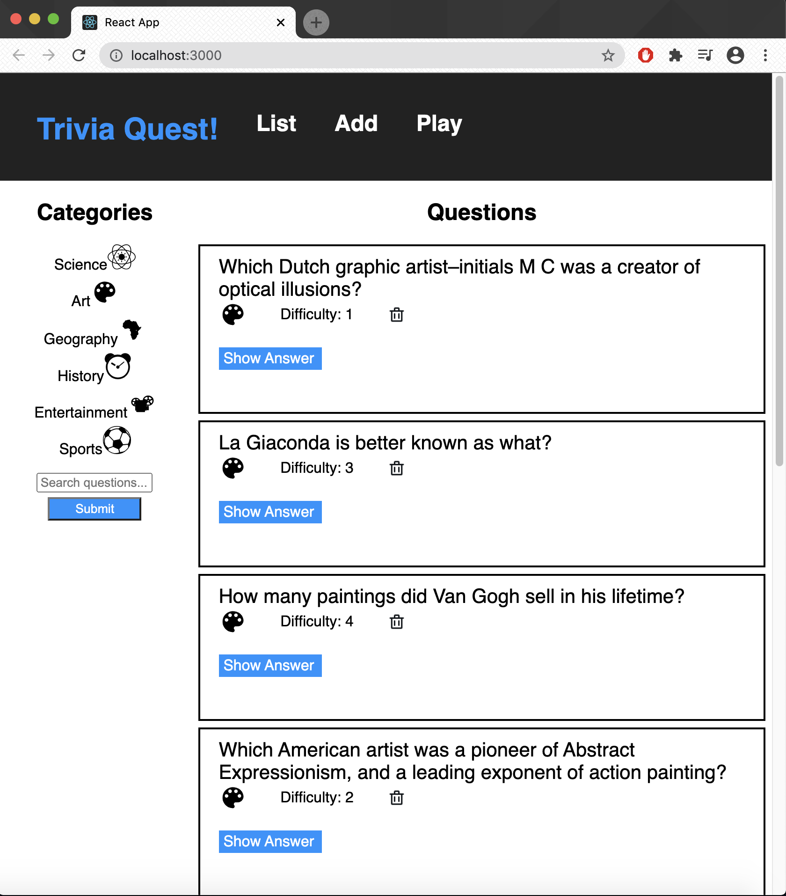

# Full Stack Trivia App

This is an application to manage a trivia webpage app and play it as a game. The front-end is minimal; the focus is on the back-end API used for accessing a postgresql database.

The application:

1) Displays questions - both all questions and by category. Question data includes the question, category and difficulty rating by default and can show/hide the answer. 
2) Deletes questions.
3) Adds questions and requires that they include question and answer text.
4) Searches for questions based on a text query string.
5) Plays the quiz game, randomizing either all questions or within a specific category. 

For more information about the frontend and backend (again the focus is on the backend), see the following links:

1. [`./frontend/`](./frontend/README.md)
2. [`./backend/`](./backend/README.md)

## About the Stack

The key functional areas are:

### Backend

The `./backend` directory contains a Flask and SQLAlchemy server. The work for this is primarily in `app.py`, where the endpoints are defined, referencing `models.py` for the DB schema and SQLAlchemy setup where necessary. 

### Frontend

The `./frontend` directory contains a complete React frontend to consume the data from the Flask server. 

[View the README.md within ./frontend for more details.](./frontend/README.md)
